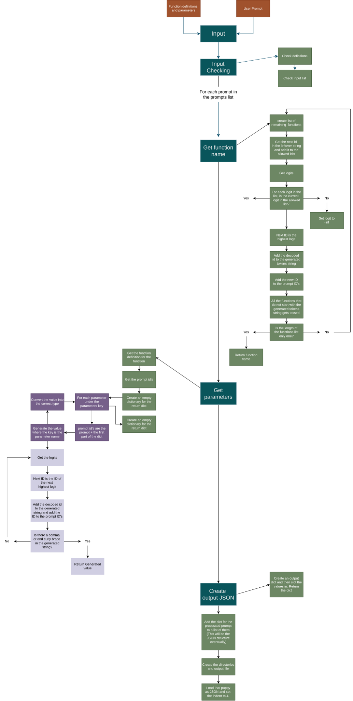
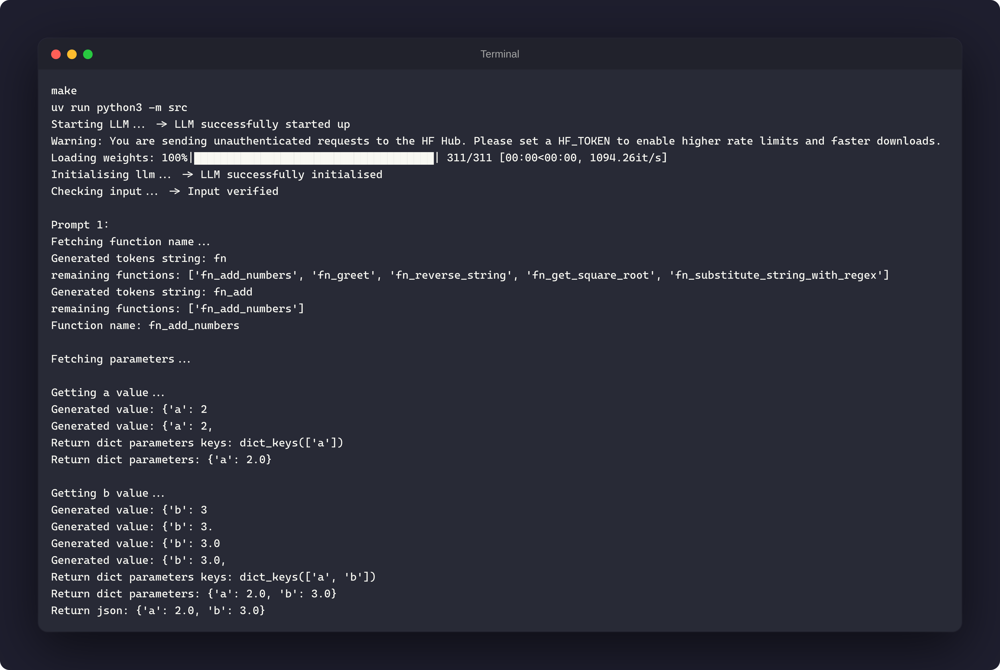

*This project has been created as part of the 42 curriculum by: lelouren*

# Description
A Python-based AI/ML project that introduces us to function calling in Large Language Models (LLMs). We need to build a constrained decoding engine that forces a small local LLM to reliably convert natural language prompts into valid, structured JSON.

# Algorithm explanation
## Function Name Selection Algorithm
For each prompt in the prompts list, the system selects the correct function name using token-level masking — greedy decoding constrained so the model can only ever produce text matching a real function name.

**Flow**<br>
1. Create a list of remaining functions — start with every function name as a live candidate.
2. Loop, one token at a time:
   - For each remaining candidate, get the next ID in its leftover string (the part not yet matched) and add it to the allowed ID's.
   - For each logit in the full output list, check: is this logit's ID in the allowed list?
      - If not → set logit to `-inf` (the model can never pick it).
   - The next ID is the highest logit left standing.
   - Add the decoded ID to the generated tokens string.
   - Add the new ID to the prompt ID's (so the model sees its own output as context for the next token).
3. Toss any functions that don't start with the generated tokens string — a candidate survives only if it's still a valid prefix match.
4. Check: is the length of the functions list only one?
   - Yes → return that function name. Done.
   - No, and list isn't empty → loop back to step 2, generate another token.
   - No candidates left → no match found for this prompt.

**Why mask instead of just generating freely?**<br>

By forcing every token choice down to only what's still consistent with a real function name, the model cannot hallucinate a name that doesn't exist — it either converges on exactly one valid match or runs out of candidates entirely. There's no in-between state where it outputs something close-but-wrong.

## Parameters Selection Algorithm
For each function name resolved, the system extracts its arguments using the same greedy-decode-and-check pattern, generating one parameter value at a time rather than asking the model to produce an entire JSON object freehand.

**Flow**<br>

1. Get the function definition for the function — pulls the parameter names and types the model needs to fill in.
2. Create an empty dictionary for the return dict.
3. For each parameter under the parameters key:
   - The prompt ID's are the prompt + the first part of the dict — priming the model with the parameter's key name so it only has to generate the value, not invent the key itself.
   - Generate the value:
      - The next ID is the ID of the next highest logit.
      - Add the decoded ID to the generated string, and add the ID to the prompt ID's (so the model sees its own output as context for the next token).
      - Check: is there a comma or end curly brace in the generated string?
         - No → loop back and generate another token.
         - Yes → return the generated value.
   - Convert the value into the correct type — cast the raw generated string (e.g. `"2.0"`) into the parameter's declared type (float, int, string, or boolean).
   - Slot the converted value into the return dict under the parameter's key.
4. Return the dict.

**Why supply the key names instead of generating them?** <br>

Letting the model freely generate an entire JSON object — keys included — opens the door to malformed output: wrong key names, missing keys, or invalid JSON structure. By supplying every key directly from the function definition and only asking the model to generate the *value*, the output structure is guaranteed correct before generation even starts — the model's only job is picking the right value for a key it's already been told.

## Project diagram


# Instructions
1. Clone the repository: <br> 
`git clone https://github.com/educate-llourens/Call_me_maybe.git`

2. Install the necessary packages and dependencies: <br>
`make install`

3. Activate the virtual environment: <br>
`activate .venv/bin/activate`

4. Ensure that you have your function definitions file and your test prompts file in the data/input folder

5. Start the program with: <br>
```make```

6. Clean temporary files with: <br>
`make clean`

7. Nuke everything including the virtual environment with: <br>
`make bonfire`

# Resources
## Documentation
- [Qwen3 Documentation](https://huggingface.co/Qwen/Qwen3-0.6B)
- [Python Documentation](https://docs.python.org/3/library/)
- [Pydantic documentation](https://pydantic.dev/docs/validation/latest/get-started/)
- [argparse tutorial](https://docs.python.org/3/howto/argparse.html#argparse-tutorial)

## Other resources
- [Handling JSON data. Here’s how they differ](https://medium.com/@jazeem.lk/handling-json-data-heres-how-they-differ-f3ca223c7851)

## AI Usage
- Creating lessons for parts of the project using scaffolding teaching methods (no code answers). I extensively researched scaffolding learning as it was my preferred teaching style. 
- Q & A sessions about topics I was not clear on. This also helps reinforce the learning over a period of time rather than learning and forgetting.
- Creating quizzes and notes for learning. Good for long term knowledge retention.
- Creating the documentation based on the project diagram, scattered notes and scattered thoughts. I have ADHD and struggle with properly documenting my thought process. So being able to throw stuff into an LLM chat for it to then turn everything into a well structured explanation helped a lot.

# Example usage


# Performance analysis
**Home PC:** 11 Prompts in 0.11 minutes <br>
**Old Mac:** 11 Prompts in 8.08 minutes <br>
**Codam upstairs computers:** 11 Prompts in 

# Design decisions
**Greedy decoding over sampling**<br>
Every generation step in this project — function name selection and parameter extraction — uses greedy decoding (always pick the highest-probability token) rather than sampling with temperature/top-k/top-p. Function calling needs a single deterministic answer, not creative variation; sampling would introduce randomness where consistency and reproducibility matter more than diversity. Greedy is also the cheapest strategy per token, which matters directly for the 5-minute runtime budget.

**Token-level masking for function name selection**<br>
Rather than letting the model freely generate a function name as text, each token is masked to the set of IDs that keep at least one candidate function name alive as a valid prefix. This makes hallucination structurally impossible — the model can never produce a name that isn't a real function, because non-matching tokens are excluded from consideration at every step. The trade-off is more per-token overhead (building the allowed-ID set requires re-encoding each remaining candidate's leftover suffix every iteration), but for a small, fixed function list this cost is negligible against the reliability gained.

**Supplying parameter keys instead of generating them**<br>
For parameter extraction, the model is never asked to invent JSON key names. Instead, the code iterates over the known parameters from the function definition and primes each key directly into the prompt (`"location": `), asking the model only to generate the *value*. This was a deliberate departure from an earlier free-form JSON approach, which produced malformed output (missing or wrong keys, values without keys) because greedy decoding gave the model too much unconstrained structure to get right in one pass. Splitting "which keys exist" (known, supplied) from "what are the values" (generated) removes an entire class of structural errors.

**Stop-condition design: earliest-match truncation**<br>
Value generation stops when a comma or closing brace appears — but not by checking whether a *whole token* equals `,` or `}`. Tokenizers don't always split cleanly at punctuation (`16}` or `john"}` can appear as single tokens). The stop condition instead searches for the *position* of the earliest stop character within the generated string and truncates there, so a value is never accidentally merged with the token that terminates it.

**Repetition guard on greedy decoding**<br>
Greedy decoding has a known failure mode: once a token creates a self-reinforcing pattern in the context (e.g. a digit that becomes its own most-likely continuation), it can loop indefinitely on the same token. Rather than trusting priming alone to prevent this, a lightweight guard masks a token to `-inf` if it would be chosen a third time in a row — cheap to check, and it fails fast (a few wasted tokens) instead of consuming the full generation budget on a degenerate output.

**Type conversion after generation, not during**<br>
Values are generated purely as strings and converted to their declared type (`float`, `int`, `str`, `bool`) only after generation completes, via a `parse_value` function driven by the function definition's declared parameter types. Integers are cast through `float()` first (`int(float(value_str))`) rather than `int()` directly, since a small model occasionally generates `"2.0"` for an integer field — going through `float()` avoids a `ValueError` from Python's stricter `int()` parser.

# Challenges faced

**Absorbing dense technical concepts all at once**<br>
Constrained decoding involves a lot of moving parts happening simultaneously — masking, autoregressive context, stop conditions, type conversion — and trying to take it all in as one continuous explanation made it hard to actually retain any of it. What worked instead was breaking each concept down into a single, isolated idea at a time (e.g. "what does masking do" completely separate from "how does the loop terminate"), confirming understanding on that one piece, then moving to the next. Learning the pipeline as a sequence of small, concrete steps rather than one large abstract system made the difference between it clicking and not.

**Needing to see the mechanism, not just read about it**<br>
Reading a description of "the model can only pick from tokens that exist in the remaining text" wasn't enough to internalize it — I needed to actually watch it happen: which tokens were allowed, which got blocked, and why. Building small interactive walkthroughs (stepping through `generate_str_param` token-by-token, watching `generated_tokens` grow while `param` shrank) turned an abstract rule into something I could trace and predict myself, which is what actually made the underlying logic stick.

**Losing track of how the pieces connect**<br>
With three separate stages — function name selection, parameter extraction, output writing — each with its own token loop, it was easy to lose sight of how state flows between them: what gets passed forward (the prompt IDs, the growing generated string), and what gets reset per parameter versus per prompt. Tracing a single concrete example end-to-end by hand, rather than trying to hold the whole abstract flow in my head at once, is what made the connections between stages clear.

**The autoregressive context bug (silently repeating output)**<br>
Early on, my parameter generation loop kept producing the same token forever (e.g. `"222222..."`). The cause wasn't obvious from the error — there wasn't one, it just looped — until I realized I was never appending the newly generated token ID back into the model's input context. Without that, the model was re-predicting "what comes after the same prompt" every iteration, with no memory of what it had already generated. This taught me that autoregressive generation depends entirely on the input growing every step; skip that, and the model can't tell it's mid-generation at all.

**Stop conditions breaking on tokenizer quirks**<br>
I assumed a stop character (like `,` or `}`) would always arrive as its own clean token. It doesn't — the tokenizer sometimes bundles it with surrounding content (`16}`, `john"}`), so a naive equality check silently missed the stop condition and let generation run past where it should've ended. Debugging this meant learning to inspect the raw generated string with `repr()` rather than trusting `print()`, since the extra characters weren't visible otherwise.

**Balancing structure against model freedom**<br>
My first attempt at parameter extraction let the model generate the entire JSON object — keys and values both — in one pass. It regularly produced malformed output: missing keys, values with no key attached. The fix required rethinking the approach rather than patching it: supply the keys directly from the function definition, and only let the model generate values. That was a useful lesson in constrained decoding generally — the less freedom you leave for structural elements you already know, the more reliable the parts you actually need the model to generate.

# Testing strategy
After each section (input checking, find the function name, and find the parameters) I would print the return and check it manually. When it reached the output, I checked the file was created and it had valid JSON. I then used copy of the moulinette to test my program. 

## Moulinette results
PASSED <br>
SCORE: 10/11

# New Tools
- [Python Formatter Beautifier](https://codebeautify.org/python-formatter-beautifier)
- [colorama - Print coloured text](https://www.geeksforgeeks.org/python/introduction-to-python-colorama/)
